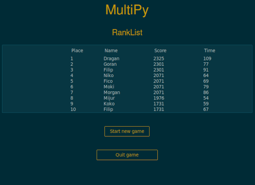
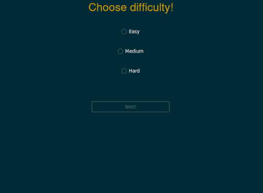
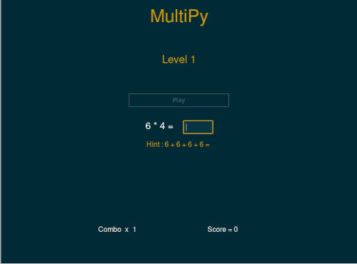
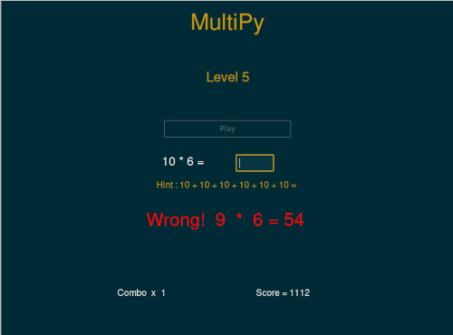
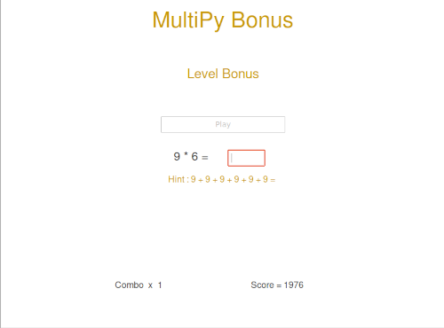
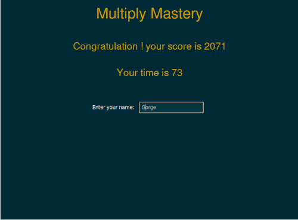

<p align="center" dir="auto">
  <a>
    
  </a>
</p>
<h1 align="center" tabindex="-1" dir="auto"><a class="anchor" aria-hidden="true"></a>MultiPy</h1>


<p align="center" dir="auto">
  Simple, intuitive, and educational mathematic game intended for kids.
  <br>
  <br>
  <a href="https://www.youtube.com/watch?v=7lJV5_z0exM">Youtube Video demo</a>
  ·
  <a href="requirements.txt">Request feature</a>
  ·
   <a href="https://mega.nz/file/7gRQ2IqQ#inkxNgmS1fo261jmxH05VmPneCEfC4FeriobVHjly4g">Windows application</a>
  ·
  <a href="https://github.com/mando984/MultiPy.git" rel="nofollow">Git hub</a>
  ·
  <a href="/resources/uml_diagram_MultiPy.pdf" rel="nofollow">Uml diagram</a>
</p>


## Table of content
* [Description](#description)
* [System Prerequisites](#system-prerequisites)
* [Installantion](#installation)
* [Gameplay](#gameplay)
* [Code Structure](#code-structure)
* [Code Architecture](#code-architecture)
* [Testing](#testing)
* [Packing the Application into an Executable (.exe) File](#pack-windows-exe)
* [Contact information](#contact-information)


## Description 
***
*MultiPy* is an interactive game designed for learning multiplication up to 10. The game consists of five levels, each with five questions, and offers three difficulty levels. It generates random questions, tracks player scores, and ranks them on a leaderboard at the end of the game. 
It's implemented in Python, using Tkinter and ttkbootstrap for the graphical user interface.
The main challenge was implementing Tkinter using an object-oriented approach, following the MVC concept. 
The next upgrade will include adding sound effects, expanding the game to include division operations, and possibly addition and subtraction as well.

## System Prerequisites
***
Before using the application, make sure you have the following prerequisites installed on your system:

* **If using an IDE** :
Python 3.x installed on your system.
Tkinter library installed (install using pip).
Ttkbootstrap library installed (install using pip).


* **If using the Windows application** :
Windows 10 or later.

These prerequisites are necessary for the proper functioning of the application. If you encounter any issues during installation or usage, please ensure that these prerequisites are met.

## Installation
***
#### For IDE Usage :

1.**Install Required Modules**:
  First, ensure that you have the Tkinter and ttkbootstrap modules installed. You can install them using pip:
  ```
  pip install tkinter 
  pip install ttkbootstrap
  ```


  2.**Clone or Download Repository**:

  Clone or download this repository to your local machine. You can do this by clicking on the "Code" button and selecting "Download ZIP", or by using git to clone the repository:

  ```
  git clone <https://github.com/mando984/MultiPy>
  ```

  3.**Navigate to Project Directory**:

  Open your terminal or command prompt and navigate to the directory where you have cloned or downloaded the repository.

  4.**Run the Application** :

  The root file of the application is project. py. You can run the application by executing the following command in your terminal or command prompt:
  
  ```
  python project.py
  ```

#### For Windows Application Usage:

  1.**Download and Unpack ZIP File**:

  Download the ZIP file containing the application.
  Unpack the ZIP file to extract its contents.

  2.**Run the Application**:

  After unpacking the ZIP file, navigate to the extracted directory.
  Run the application by executing the executable file or by double-clicking on it.

These steps will guide you through the process of installing and running the application, whether you are using an IDE or running the Windows application directly. If you encounter any issues during installation or usage, feel free to reach out for assistance.


## Gameplay
***
When the game starts, the `Main page` is displayed . The main page shows a rank table featuring the best players, as well as buttons for `Start Game` and `Quit Game`.

Main page:




Upon starting the game, move to the `Second Page` and select the desired difficulty level (easy, medium, hard) and press `Next` button.

Second Page:




On the `Third Page`, the status of the current level is displayed at the top of the screen. In the middle of the screen, the question, answer, and hint frame are displayed. On the bottom left, the combo is shown. To start the level, click the `Start Level` button. Answer the multiplication questions by entering the correct value and pressing the `Enter` key on the keyboard. Each time the player's answer is correct, the combo (the number of consecutive correct answers given by the player) increases by 5 and is added to the score. The score is displayed in the bottom right corner. During gameplay, a timer counts down as the level progresses. If the level finishes, the timer stops.

Third Page:



When the player presses 'Enter' to submit their answer, feedback is displayed below the hint frame. There are two types of feedback: `Correct Answer` and `Wrong! a * b = c`.
If the answer is wrong, the combo resets to 1.

Third Page 2:




If the player's time is less than 75 seconds, they receive a `Bonus Level`.

Bonus Level:



When the game finishes, players are directed to the `Fourth Page` where their score and time are displayed. On this page, players enter their name in an entry field. Upon submitting their name, the application places the player in a table and ranks them. Finally, players are returned to the main page.

Fourth Page:




## Code Structure
***


1. **project**/

    **init. py**: Marks the directory as a Python package.

    **project. py**: Main file of the project containing core code and functions to run the project.

    **test_project.py**: Contains tests to verify the correctness of the project's code.

    **requirements.txt**: Lists Python packages and their versions required to execute the project.

    **README. md**: Contains project description, installation instructions, usage guidelines, and other important information.

2. **gui**/

    **init. py**: Marks the directory as a Python package.

    **application. py**: Initializes the application and manages its display.

    **main_page. py**, **second_page. py**, **third_page. py**, **fourth_page. py**: Contains code related to the main screens or pages of the application.

3. **data**/

    **init. py**: Marks the directory as a Python package.

    **table. py**: Contains code for processing or manipulating data tables.

    **rankList. csv**, **easy. py**, **medium. py**, **hard. py**, **score. py**: Contains various data or scripts used in the project, such as ranking data, score calculation scripts, etc.

4. **resources**/

    Contains various project resources such as images, icons, sounds, etc.


<details>
<summary>Click to expand</summary>
<pre>
project/
|-- __init__.py
|-- project.py
|-- test_project.py
|-- requirements.txt
|-- README.md
|
|-- gui/
|   |-- __init__.py
|   |-- application.py
|   |-- main_page.py
|   |-- second_page.py
|   |-- third_page.py
|   |-- fourth_page.py
|
|-- data/
|   |-- __init__.py
|   |-- table.py
|   |-- rankList.csv
|   |-- easy.py
|   |-- medium.py
|   |-- hard.py
|   |-- score.py
|
|-- resources/
</pre>
</details>


## Code Architecture
***

The application architecture follows the MVC pattern. The data directory is used for the model. The gui directory is used for the view. The controller is project. py. The controller is supported by application. py, located in the gui directory. The Application class is responsible for managing windows.


application. py:
```python

class Application(Tk.tk):

        self.start_level = start_level

        self.show_frame1()
        ...


    def show_frame1(self):

        ...


    def show_frame2(self):

        ...


    def show_frame3(self):

        ...


    def show_frame4(self):

        ...

```

The entire game logic is housed in project. py. In project.py, from where Applications are instantiated.

project.py:
```python

def main():

    global apps

    apps = Application(start_level)

    apps.start_application()


def start_level():

    ...


def play_one_round():

    ...


def update_label_text():

    ...
```
Further program flow occurs using the tkinter graphical interface. When the user interacts with the GUI and clicks the `Start new game` button in main_page.py, it transitions to the next window.

application. py:

```python

self.frame2 = SecondPage(self.show_frame3)
```

In second_page.py, the `difficulty level` is chosen and stored in the Application class. Then it transitions to third_page.py from application. py.

```python

self.frame3 = ThirdPage(self.show_frame4, self.start_level_callback)
```

The game takes place there. When the user clicks the `Start level` button, it triggers in project. py:

```python

def start_level():

    ...
```
This happens five times:

```python

def play_one_round():

    ...
```
When the level is completed, it transitions to:

```python

def update_label_text():

    ...
```
This function updates the level, manages the current level, ends the game, or triggers a bonus level if conditions are met. Finally, it moves to the next page. Fourth page ensures that the user enters their name, their score is recorded in the table, and they return to the main page. A graphical representation of the sequential diagram is shown in the UML diagram at the top of the page.


## Testing
***
Before testing, you must install pytest and unittest.

```
    pip install -U pytest
    pip install unittest
```
More info about pytest on :                  
[pytest documentation](https://docs.pytest.org/en/8.0.x/contents.html)

Because the application structure is separated into several directories and I use relative paths in the code, it becomes difficult to import every part into the test. You must add system paths.

It is necessary to include the absolute path of the root directory in the system's path.
<sys.path.append(absolute path of root directory).>

```
import sys
sys.path.append('C:/Users/mando/OneDrive/Documents/MuliPy')
```
"When using unittest, you can run a Python script and test directly through unit tests with the following code:
```
    if __name__ == '__main__':
         unittest.main()
```


## Packing the Application into an Executable (.exe) File
***
Before packing an executable application, ensure that you have the necessary system requirements for building apps. The first step is to install PyInstaller using the command 

```
pip install pyinstaller.
```

Since the application contains three subdirectories, it's important to include them in your PyInstaller commands. Use the following command:

```
pyinstaller --onedir --add-data "resources;resources" --add-data "data;data" --add-data "gui;gui" --icon=my_icon.ico project.py
```

More info on:
```
https://www.pyinstaller.org/en/stable/installation.html
```

This command will package your application into a Windows executable (.exe) file. 
The `--onedir` option ensures that all files are organized within a single directory. Additionally, the `--add-data` option specifies additional data directories that should be included in the executable. Finally, the `--icon` option allows you to specify an icon for your application.


## Contact information:
Email: mando984@gmail.com

LinkedIn: [Dalibor Mandic](https://www.linkedin.com/in/dalibor-mandic-006165261?utm_source=share&utm_campaign=share_via&utm_content=profile&utm_medium=android_app)

Instagram: [@mandicd84](https://www.instagram.com/mandicd84/?igsh=YzljYTk1ODg3Zg%3D%3D)

