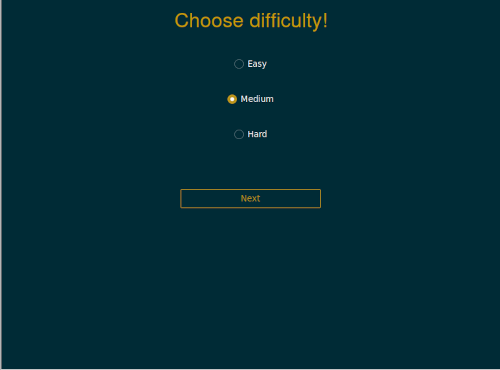
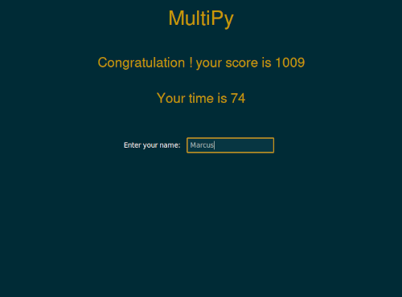

  

<h1 align="center" tabindex="-1" dir="auto">MultiPy</h1>

  Simple, intuitive, and educational mathematic game intended for kids.
   
   
  <a href="">Youtube video</a>
  ·
  <a href="requirements.txt">Request feature</a>
  ·
  <a href="https://github.com/mando984/MultiPy.git" rel="nofollow">Git hub</a>
  ·
  <a href="/resources/uml_diagram_MultiPy.pdf" rel="nofollow">Uml diagram</a>

### Table of content
* [Description](#description)
* [Prerequisites](#prerequest)
* [Installantion](#installation)
* [Running Apps](#running-apps)
* [Gameplay](#gameplay)
* [Code Structure](#code-structure)
* [Code Architecture](#code-architecture)

### Description

*MultiPy* is an interactive game designed for learning multiplication up to 10. The game consists of five levels, each with five questions, and offers three difficulty levels. It generates random questions, tracks player scores, and ranks them on a leaderboard at the end of the game. 
It's implemented in Python, using Tkinter and ttkbootstrap for the graphical user interface.
The main challenge was implementing Tkinter using an object-oriented approach, following the MVC concept. 
The next upgrade will include adding sound effects, expanding the game to include division operations, and possibly addition and subtraction as well.

### Prerequisites
Python 3.x installed on your system.

Tkinter library installed (install using pip).

Ttkbootstrap library installed (install using pip).

### Installation
Install the Tkinter module and the ttkbootstrap module.
Clone or download this repository to your local machine.
Navigate to the project directory in your terminal or command prompt.
The root file is `project.py`.

### Gameplay
"When the game starts, the main page is displayed. The main page shows a rank table featuring the best players, as well as buttons for `Start Game` and `Quit Game`."

Upon starting the game, move to the second page and select the desired difficulty level (easy, medium, hard) and press `Next` button.

On the third page, the status of the current level is displayed at the top of the screen. In the middle of the screen, the question, answer, and hint frame are displayed. On the bottom left, the combo is shown. To start the level, click on the 'Start Level' button. Answer the multiplication questions by entering the correct value and pressing the 'Enter' key on the keyboard. Each time the player's answer is correct, the combo increases by 5 and is added to the score. The score is displayed in the bottom right corner. While the level is running, a timer counts down. If the level finishes, the timer stops."

When the player presses 'Enter' to submit their answer, feedback is displayed below the hint frame. There are two types of feedback: `Correct Answer` and `Wrong! a * b = c`.
If the answer is wrong, the combo resets to 1.

If the player's time is less than 75 seconds, they receive a bonus level.

When the game finishes, players are directed to the fourth page where their score and time are displayed. On this page, players enter their name in an entry field. Upon submitting their name, the application places the player in a table and ranks them. Finally, players are returned to the main page.

### Code Structure

### Code Architecture

